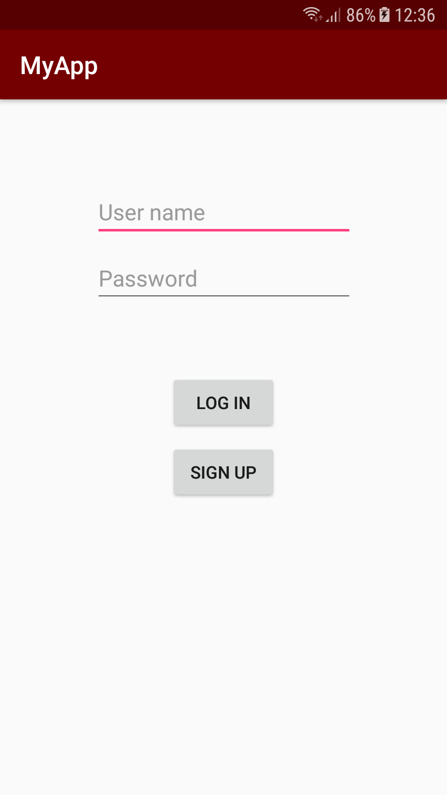
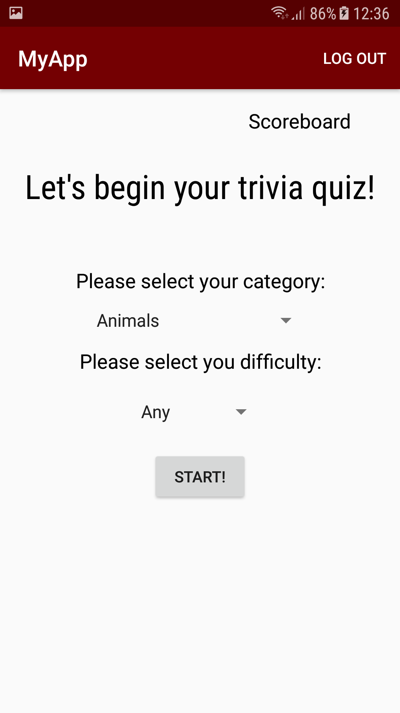
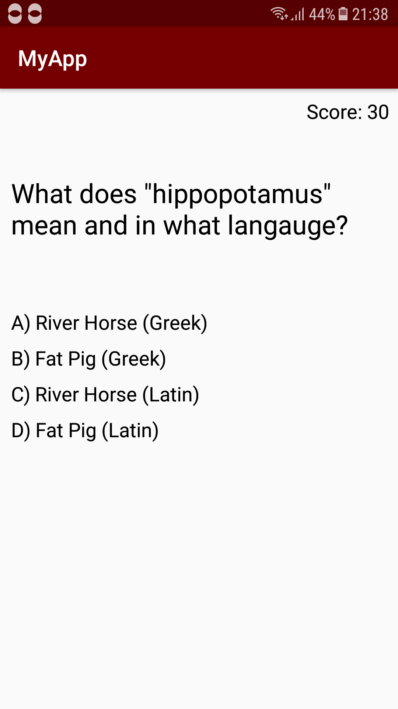
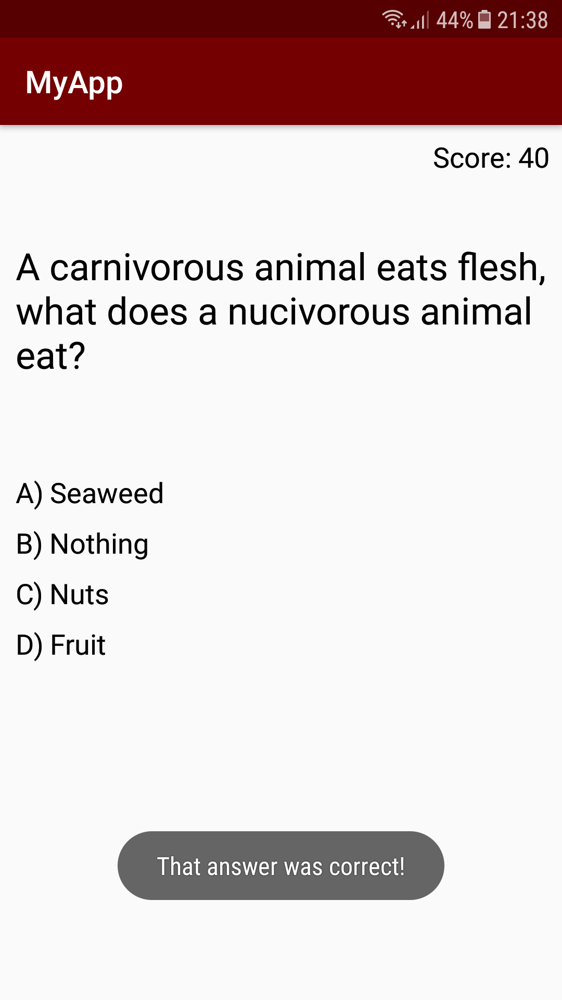
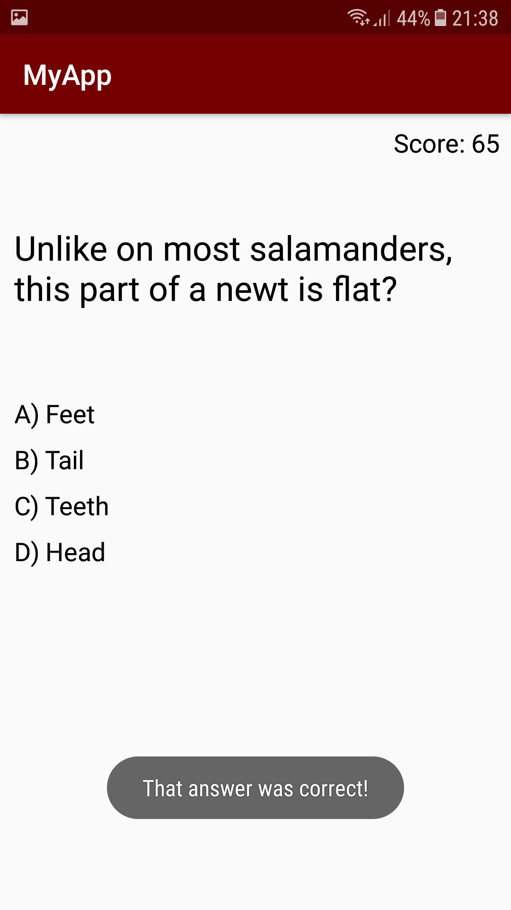
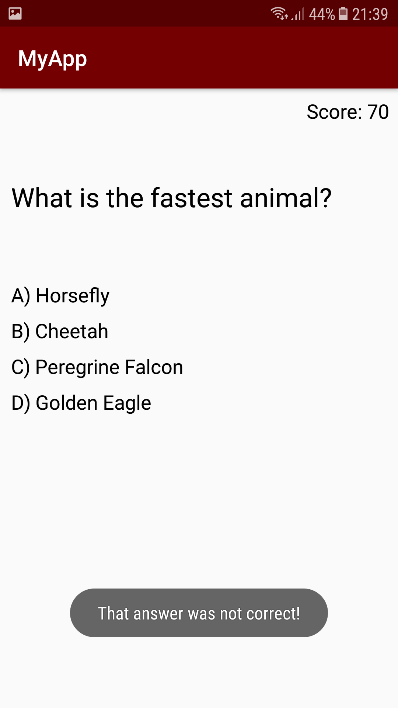
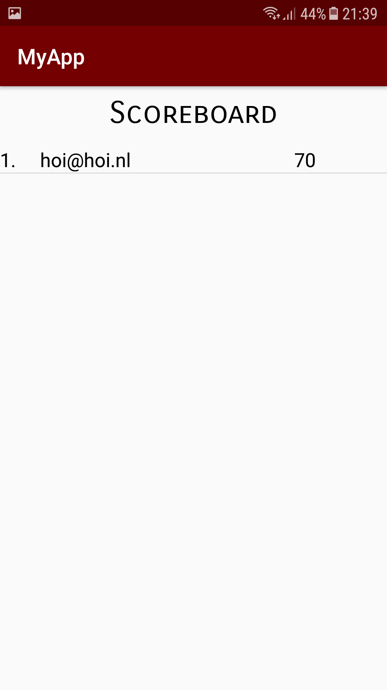

### MyApp

This app is a simple trivia app. The user had to create an account and log in. The user can choose a category and difficulty for the 
questions. The questions are multiple choice, for each correct answer the user gets 10 points and for every wrong answer the score 
will lower by 5.

